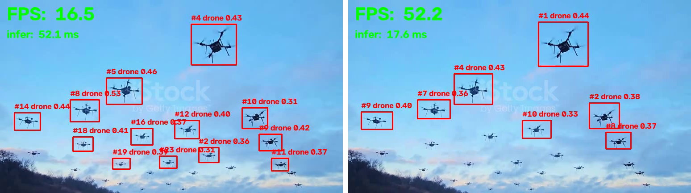
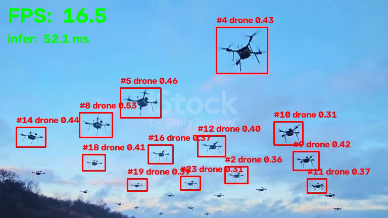
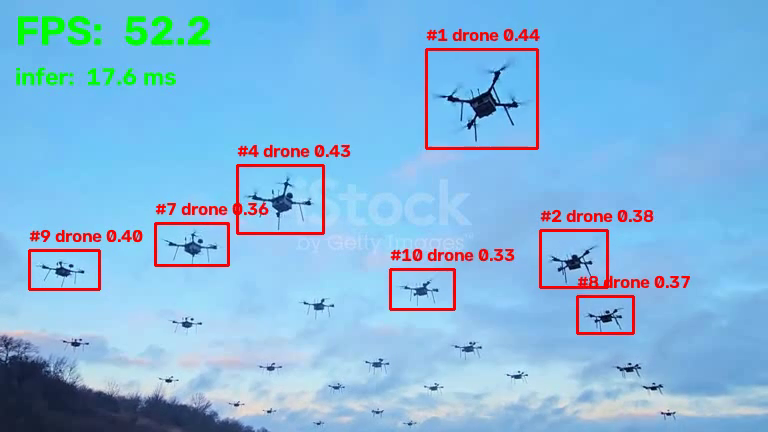
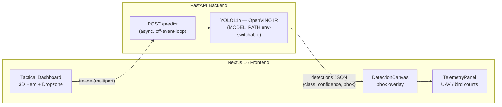
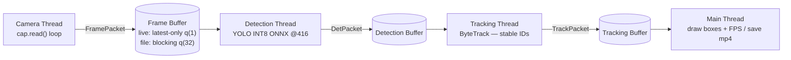
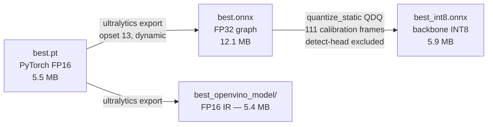
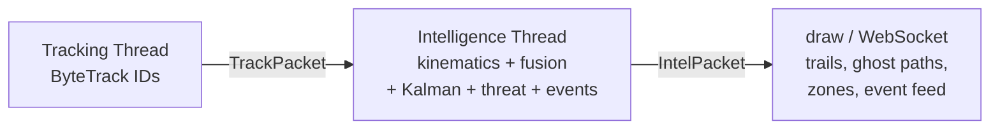

#  DRONE DETECTION — YOLO11n + Real-Time CPU Optimization

Drone-vs-bird aerial detection system: a custom-trained **YOLO11n** model, a **FastAPI** inference backend, a **Next.js** tactical dashboard — and a fully measured **CPU inference optimization pipeline that took detection from 13.7 FPS to 52+ FPS (×3.8) on a laptop CPU, no GPU required**.


*Left: baseline PyTorch, 16 FPS, 52 ms/frame. Right: optimized pipeline, 52 FPS, 17 ms/frame. Same video, same laptop.*

---

##  Performance Optimization — Results

**Hardware:** Intel Core i7-1185G7 @ 3.00GHz (4 cores, AVX-512 VNNI) + Iris Xe iGPU · **no discrete GPU**
**Test:** drone-swarm video, 768×432 @ 30fps, 441 frames · every stage includes full per-frame work: decode → detect → track

### The stacked gains (each row adds one technique)

| Stage | Model | imgsz | Threads | FPS | infer p50 (ms) | Speedup |
|---|---|---|---|---|---|---|
| BASELINE (PyTorch) | best.pt | 640 | single | **13.71** | 52.5 | ×1.00 |
| + ONNX Runtime | best.onnx | 640 | single | **23.94** | 37.0 | ×1.75 |
| + INT8 quantization | best_int8.onnx | 640 | single | **26.83** | 31.4 | ×1.96 |
| + Downscale 416 | best_int8.onnx | 416 | single | **48.81** | 16.4 | ×3.56 |
| **+ 3-thread pipeline** | best_int8.onnx | 416 | 3-thread | **52.35** | 18.0 | **×3.82** |

### Alternative runtime: OpenVINO (Intel's TensorRT equivalent)

| Config | FPS | Notes |
|---|---|---|
| OpenVINO CPU @640 | 28.30 | beats both ONNX FP32 and INT8 at 640 |
| **OpenVINO CPU @640 + threads** | **33.50** | 🏆 best **lossless** config — real-time with zero accuracy loss |
| OpenVINO iGPU @640 | 18.79 | measured & rejected: transfer overhead beats iGPU compute for a 2.6M-param model |

### Accuracy check (honest trade-offs, measured)

| Config | Detections (15 sampled frames) | vs baseline |
|---|---|---|
| PyTorch @640 (baseline) | 119 | — |
| INT8 ONNX @640 | 130 | ✅ no loss |
| OpenVINO @640 | per-frame parity with ONNX | ✅ no loss |
| INT8 ONNX @416 | 71 | ⚠️ −40% on small/distant drones |

### Recommended configurations

| Goal | Config | FPS |
|---|---|---|
| Max accuracy, real-time | OpenVINO @640 + 3-thread pipeline | **33.5** |
| Max speed | INT8 ONNX @416 + 3-thread pipeline | **52.4** |

 Full report with methodology: [OPTIMIZATION_RESULTS.md](OPTIMIZATION_RESULTS.md)
 Video proof: [test_assets/demo_before.mp4](test_assets/demo_before.mp4) · [test_assets/demo_after.mp4](test_assets/demo_after.mp4) (FPS counter burned into every frame)

| Before (PyTorch, single-thread) | After (INT8 + 416 + 3 threads) |
|---|---|
|  |  |

---

##  Architecture

### System architecture



### Real-time 3-thread pipeline (producer–consumer with shared buffers)



All three stages run **simultaneously on different frames** — throughput is set by the slowest stage (detection), not the sum of all stages. Live mode uses drop-oldest `maxsize=1` buffers so the display never lags behind the camera; file mode uses blocking buffers so every frame is processed.

### Model optimization pipeline



---

##  KITE — Kinematic Intelligence & Threat Engine

Drones and birds are visually similar at distance — the classic false-positive
source. KITE classifies targets by **how they move**, not just how they look:
a 4th pipeline stage after tracking that extracts per-track kinematic features
(straightness, wingbeat periodicity via FFT, hover score, turn geometry),
fuses them with YOLO's appearance confidence, predicts each track's path with
a Kalman filter, scores threat against user-drawn keep-out zones, and streams
everything live to the web dashboard over WebSocket.



### Measured results (full protocol in [KINEMATICS_RESULTS.md](KINEMATICS_RESULTS.md))

The appearance model alone is **degenerate on bird footage — it calls every
bird track "drone"** (241/241 on four bird clips). Motion fixes what pixels
can't:

| Config | Bird false alarms | Drone recall | Balanced acc |
|---|---|---|---|
| Appearance-only | 241/241 (100%) | 21/21 (trivially — it calls everything drone) | 0.50 |
| **Fused (KITE) @ 0.55** | **106/241 (−56%)** | 17/21 (81%) | **0.685** |

- Intel stage overhead: **p50 3.1 ms / p95 5.4 ms** per frame on a ~20-track
  swarm (scales with track count; 1–3 track scenes are sub-ms). FPS 35.1 → 30.3.
- Full decision-threshold sweep (0.30–0.75) measured from one pipeline pass;
  operating point = max balanced accuracy with drone recall ≥ 80%.
- Independent stills check (`scripts/eval_dataset.py`, Roboflow drone-vs-bird
  COCO test split, 293 images): the appearance model **never predicts "bird"
  at all** — 0/61 bird boxes correct (53 called drone, 8 missed). It is a
  single-class drone detector in practice; motion is the only available
  bird-vs-drone signal.

### Try it

```bash
# CLI: fused classification + trails + predicted paths + events
python scripts/pipeline_demo.py --intel

# with keep-out zones (implies --intel): zone breach / inbound events
python scripts/pipeline_demo.py --zones zones.json

# regenerate the measured results table
python scripts/benchmark_kinematics.py

# unit tests (synthetic trajectories — no video or model needed)
python -m pytest tests/
```

**Web:** start both servers (below), open http://localhost:3000, switch the
dashboard to **LIVE INTELLIGENCE**, upload a video — live tracked boxes
colored by threat level, fading trails, Kalman ghost paths, click-to-draw
keep-out zones, and a live tactical event feed. Click any target for its
kinematic readout (wingbeat Hz, hover score, straightness, threat).

*Assumptions & limits: mostly-static camera (ego-motion compensation is
future work); tracks shorter than 8 frames fall back to appearance-only;
wingbeat features need ≥ 12 samples. See the caveats note in
[KINEMATICS_RESULTS.md](KINEMATICS_RESULTS.md).*

---

##  Engineering notes (what actually went wrong & how it was fixed)

1. **Full INT8 quantization gave ZERO detections.** The YOLO detection head (DFL box decoder, `model.23`, 172 nodes) is numerically too fragile for 8-bit. Fix: quantize only the backbone/neck (~90% of compute), keep the head in float → full accuracy restored. See `scripts/export_model.py`.
2. **The threaded pipeline silently dropped 158 of 441 frames.** The end-of-stream sentinel was `None` — but an empty queue *also* returns `None` on timeout, so consumers mistook a momentary stall for end-of-video. Fix: a unique `object()` sentinel. Classic producer-consumer bug, caught because frame counts didn't match.
3. **The iGPU was measured and rejected.** Iris Xe inference was *slower* than the CPU (18.8 vs 28.3 FPS) — per-frame CPU↔GPU transfer overhead dominates for a small model. Decision backed by data, not assumption.
4. **OpenVINO @416 was slower than @640** — the IR is optimized for its export shape; odd input sizes hit a slow dynamic-shape path. Downscaling is paired with ONNX INT8 instead, where it works.

**Next step on NVIDIA hardware** (Jetson / RTX): the same recipe with TensorRT — `model.export(format="engine", int8=True)` + the same calibration frames + the same 3-thread pipeline.

---

##  Quickstart

```bash
git clone https://github.com/kanishk083/DRONE-DETECTION.git
cd DRONE-DETECTION
pip install -r requirements.txt
pip install onnx onnxruntime openvino supervision imageio-ffmpeg
```

### Reproduce the optimization results

```bash
python scripts/export_model.py           # best.pt -> ONNX FP32 -> INT8 (calibrated) + OpenVINO IR
python scripts/benchmark_video.py        # regenerates the full FPS table
```

### Live demo (window with boxes, track IDs, FPS counter)

```bash
python scripts/pipeline_demo.py --sequential --model best.pt   # BEFORE: ~14 FPS
python scripts/pipeline_demo.py --imgsz 416                    # AFTER:  ~50 FPS
python scripts/pipeline_demo.py --model models/best_openvino_model   # lossless: ~33 FPS
python scripts/pipeline_demo.py --source 0                     # live webcam
python scripts/pipeline_demo.py --imgsz 416 --no-show --save out.mp4  # save annotated H.264 video
```

### Run the web app

```bash
# backend (serves the OpenVINO model by default)
python -m uvicorn api.main:app --port 8000

# frontend
cd frontend && npm install && npm run dev   # http://localhost:3000
```

Or with Docker (backend only): `docker-compose up`

---

## 📁 Project structure

```
├── api/main.py                  # FastAPI: /predict (async, thread-pooled), /health
├── frontend/                    # Next.js 16 tactical dashboard (R3F 3D hero, dropzone, overlays)
├── scripts/
│   ├── export_model.py          # PT -> ONNX -> INT8 (calibrated, head-excluded) + OpenVINO
│   ├── benchmark_video.py       # stacked FPS benchmark table
│   └── pipeline_demo.py         # 3-thread pipeline + live demo + --save
├── models/                      # best.onnx / best_int8.onnx / best_openvino_model/
├── test_assets/                 # test video + annotated before/after demo videos
├── assets/                      # FPS proof screenshots
├── OPTIMIZATION_RESULTS.md      # full measured report
├── best.pt                      # trained YOLO11n weights (drone/bird)
└── Drone_Detection_2.ipynb      # training notebook (Roboflow -> YOLO11n, 32 epochs)
```

---

##  Model training

The detector is a **YOLO11n** fine-tuned to classify small aerial targets as `drone` or `bird` — visually similar at distance, a classic false-positive source in surveillance systems.

- **Dataset:** ~2,783 frames merged from two Roboflow drone-vs-bird datasets (urban, rural, open-sky scenes)
- **Training:** 32 epochs · imgsz 640 · batch 16 · AdamW · lr0 0.001 (see [Drone_Detection_2.ipynb](Drone_Detection_2.ipynb))
- Get a free API key at [roboflow.com](https://roboflow.com) and set it in the notebook to re-download the datasets

### Web app in action


---

##  Acknowledgements

- [Ultralytics](https://github.com/ultralytics/ultralytics) — YOLO11 models and export tooling
- [ONNX Runtime](https://onnxruntime.ai/) & [OpenVINO](https://docs.openvino.ai/) — inference runtimes
- [supervision](https://github.com/roboflow/supervision) — ByteTrack tracking
- Roboflow Universe — training datasets
